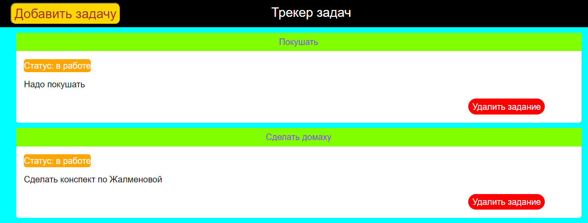

# Task-Manager - Система контроля заданий
Онлайн менеджер заданий
_____
Использование
===============
1. Контроль заданий работы в группе
2. Ведение дневника записей
3. Др. варианты
_____
Структура проекта
===============
- main.py - основной файл запуска сервера
- templates/front.html - шаблон страницы, отображающей список заданий
- templates/create-task.html - шаблон страницы добавления нового задания
_____
Технологии
===============
1. Flask - для создания Web-приложения
2. SqlAlchemy - для работы с БД
3. CSS - стилизация шаблонов
______
Интерфейс пользователя
===============

>
>При входе на сайт пользователь может увидеть пустой список задач, а также добавить новые задачи, нажав на кнопку добавить задачи
>
______

Список задач
============
>При наличии хотя бы одной задачи, она будет отображена пользователю
>
